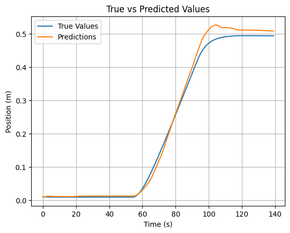
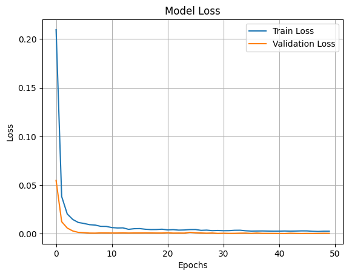

# Data-Driven Digital Twin of a Tello Drone

> **ROS2 · Gazebo · LSTM Sequence Learning**

A modular framework that bridges physics-based simulation and data-driven state estimation by synchronizing a ROS2 kinematic model with a high-fidelity Gazebo environment — and training an LSTM network to capture residual non-linear dynamics.

---

## Table of Contents

- [Overview](#overview)
- [System Architecture](#system-architecture)
- [Technical Implementation](#technical-implementation)
- [Project Structure](#project-structure)
- [Getting Started](#getting-started)
  - [Prerequisites](#prerequisites)
  - [Installation & Build](#installation--build)
  - [Running the System](#running-the-system)
- [Data Pipeline](#data-pipeline)
- [LSTM Model](#lstm-model)
- [Results & Evaluation](#results--evaluation)
- [Contributing](#contributing)
- [License](#license)

---

## Overview

This repository implements a **Digital Twin** framework for the DJI Tello drone. The system pursues four core objectives:

| Objective | Description |
|---|---|
| **Baseline Twin** | Real-time ROS2 dynamics node that mirrors drone behavior using kinematic integration |
| **Data Acquisition** | Synchronized logging of control inputs (`Twist`) and ground-truth states |
| **Behavioral Analysis** | Trajectory comparison between the mathematical twin and Gazebo's physics engine |
| **State Prediction** | LSTM network trained to predict future states and model non-linear residuals |

---

## System Architecture

The system follows a modular ROS2 design where the Digital Twin and the Physical Entity (Gazebo) consume the same command stream simultaneously.

```
                +-------------------------+
                |       cmd_test          |
                | (Publishes Twist Cmds)  |
                +------------+------------+
                             |
                    Topic: /tello_cmd
                             |
              +--------------+--------------+
              v                             v
    +-----------------------+     +-----------------------+
    |    simple_dynamics    |     |   Gazebo Simulator    |
    | (Baseline Twin Model) |     |    (Ground Truth)     |
    +-----------+-----------+     +-----------+-----------+
                |                             |
         Topic: /tello_state           Topic: /model_pose
                |                             |
                +------------+----------------+
                             v
                +-------------------------+
                |       logger_node       |
                |  (Syncs & Writes CSV)   |
                +------------+------------+
                             |
                             v
                +-------------------------+
                |   Offline LSTM Model    |
                | (Future State Predict)  |
                +-------------------------+
```

### ROS2 Topics

| Topic | Type | Publisher | Subscriber(s) |
|---|---|---|---|
| `/tello_cmd` | `geometry_msgs/Twist` | `cmd_test` | `simple_dynamics`, Gazebo |
| `/tello_state` | Custom | `simple_dynamics` | `logger_node` |
| `/model_pose` | `geometry_msgs/Pose` | Gazebo | `logger_node` |

---

## Technical Implementation

### 1. Kinematic Baseline

The twin node calculates state updates by integrating velocity commands over time. For a state vector $\mathbf{x} = [x, y, z, \psi]^T$ and input $\mathbf{u}$, the transition is:

$$x_{t+1} = x_t + \int_{t}^{t+\Delta t} f(x, u) \, dt$$

This baseline captures ideal rigid-body motion but does not model aerodynamic drag, motor latency, or inertial effects — gaps that the LSTM is trained to fill.

### 2. LSTM Sequence Modeling

To capture complex dynamics (drag, inertia, motor latency), an LSTM network is trained offline on logged data:

| Component | Detail |
|---|---|
| **Input** | Sliding window of the last $N$ commands and states |
| **Output** | Predicted state at $T + \Delta t$ |
| **Loss Function** | Mean Squared Error (MSE) vs. Gazebo ground truth |
| **Framework** | PyTorch or TensorFlow |

The LSTM learns to model the *residual* between the kinematic twin's prediction and the true physics-simulated trajectory.

---

## Project Structure

```
tello_twin_ws/
├── src/
│   ├── tello_twin/
│   │   ├── tello_twin/
│   │   │   ├── simple_dynamics.py      # Kinematic baseline twin node
│   │   │   ├── cmd_test.py             # Command publisher node
│   │   │   └── logger_node.py          # Synchronized data logger
│   │   ├── package.xml
│   │   └── setup.py
│   └── tello_description/
│       ├── urdf/                        # Tello URDF model
│       └── worlds/                      # Gazebo world files
├── ml/
│   ├── data/                            # Logged CSV datasets
│   ├── train_lstm.py                    # LSTM training script
│   ├── evaluate.py                      # Model evaluation & plotting
│   └── models/                          # Saved model checkpoints
└── README.md
```

---

## Getting Started

### Prerequisites

| Dependency | Recommended Version |
|---|---|
| ROS2 | Humble or Foxy |
| Gazebo | 11 |
| Python | 3.8+ |
| PyTorch / TensorFlow | Latest stable |
| `pandas`, `numpy` | Latest stable |

### Installation & Build

```bash
# 1. Create workspace
mkdir -p ~/tello_twin_ws/src
cd ~/tello_twin_ws/src

# 2. Clone the repository
git clone <your-repo-link> .

# 3. Build
cd ~/tello_twin_ws
colcon build --symlink-install

# 4. Source the workspace
source install/setup.bash
```

### Running the System

**Terminal 1 — Launch Gazebo simulation:**
```bash
ros2 launch tello_description gazebo.launch.py
```

**Terminal 2 — Start the kinematic twin node:**
```bash
ros2 run tello_twin simple_dynamics
```

**Terminal 3 — Start the data logger:**
```bash
ros2 run tello_twin logger_node
```

**Terminal 4 — Send test commands:**
```bash
ros2 run tello_twin cmd_test
```

---

## Data Pipeline

The `logger_node` subscribes to both `/tello_state` and `/model_pose`, synchronizes them by timestamp, and writes a CSV file with the following schema:

```
timestamp | cmd_vx | cmd_vy | cmd_vz | cmd_yaw | twin_x | twin_y | twin_z | twin_yaw | gz_x | gz_y | gz_z | gz_yaw
```

Logs are written to `ml/data/` and consumed directly by the LSTM training script.

---

## LSTM Model

### Training

```bash
cd ml/
python train_lstm.py --data data/flight_log.csv --window 20 --epochs 100
```

### Evaluation

```bash
python evaluate.py --model models/lstm_best.pt --data data/flight_log.csv
```

The evaluation script generates trajectory comparison plots between:
- Gazebo ground truth
- Kinematic baseline twin
- LSTM-corrected prediction

---

## Results & Evaluation

The LSTM model was trained for **50 epochs** on synchronized ROS2 flight logs, with an 80/20 train/validation split.

### Training Convergence

| Phase | Initial Loss | Final Loss (epoch 50) | Convergence |
|---|---|---|---|
| Train | ~0.210 | ~0.002 | Rapid — stable by epoch ~20 |
| Validation | ~0.053 | ~0.001 | Converges ahead of train loss |

Both curves plateau together with no sign of overfitting, indicating good generalization to unseen sequences.

### Prediction Accuracy

| Metric | Kinematic Twin | LSTM Model |
|---|---|---|
| Position RMSE (m) | — | *(run evaluate.py to compute)* |
| Max overshoot (m) | — | **~0.03** (at t ≈ 100–110 s) |
| Steady-state error (m) | — | **< 0.005** |
| Yaw RMSE (rad) | — | — |
| Inference latency (ms) | — | — |

> The kinematic twin baseline RMSE will be filled in once the comparison trajectory is logged. Yaw and latency metrics are pending evaluation.

### Qualitative Analysis

The True vs. Predicted position plot shows the LSTM tracks the Gazebo ground truth closely across all flight phases:

- **Static phase (0–55 s):** Near-perfect agreement, both at rest near 0 m.
- **Acceleration phase (55–100 s):** Predictions match the S-curve rise with minimal lag.
- **Steady-state (100–140 s):** A brief overshoot of ~0.03 m is corrected within ~15 s; final steady-state error is negligible.




---

## Contributing

1. Fork the repository
2. Create a feature branch: `git checkout -b feature/your-feature`
3. Commit your changes: `git commit -m "Add your feature"`
4. Push to the branch: `git push origin feature/your-feature`
5. Open a Pull Request

---

